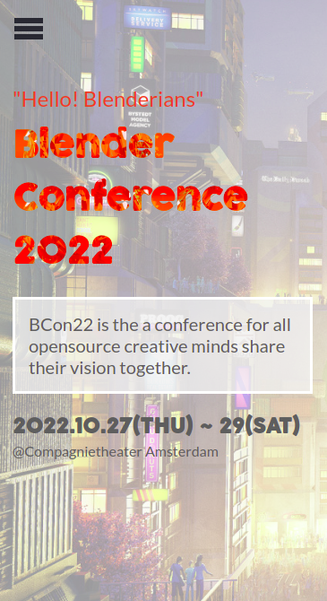
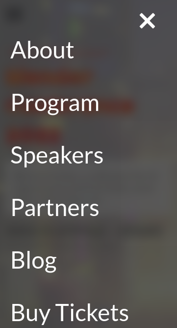
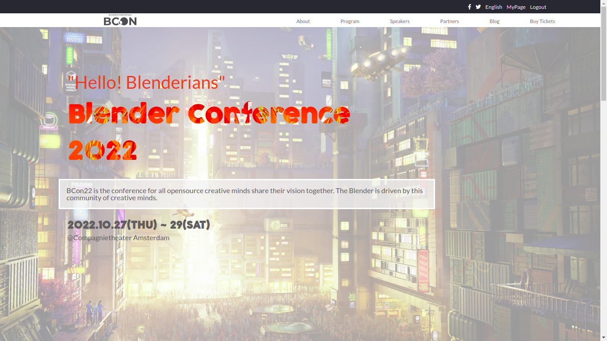

# Portfolio

> One paragraph statement about the project.

## Built With

- HTML
- CSS
- Javascript
- Git

## Live Demo

[Live Demo Link](https://vikipretium.github.io/First_Capstone_Project/)

## Author

👤 **Vignesh**

- GitHub: [@vikipretium](https://github.com/vikipretium)
- Twitter: [@vikipretium](https://twitter.com/vikipretium)
- LinkedIn: [vikipretium](https://linkedin.com/in/vikipretium)

### UI Design:
👤 **Cindy Shin** 
- GUI & Graphic Designer 
- Seoul, Korea  
- Behance:[@adagio07](https://www.behance.net/adagio07)
- LinkedIn: [@adagio07](http://linkedin.com/in/adagio07)

Contributions, issues, and feature requests are welcome!

Feel free to check the [issues page](../../issues/).

## Show your support

Give a ⭐️ if you like this project!

## Acknowledgments

- Hat tip to anyone whose code was used
- Inspiration
- etc

## 📝 License

This project is [MIT](./MIT.md) licensed.
